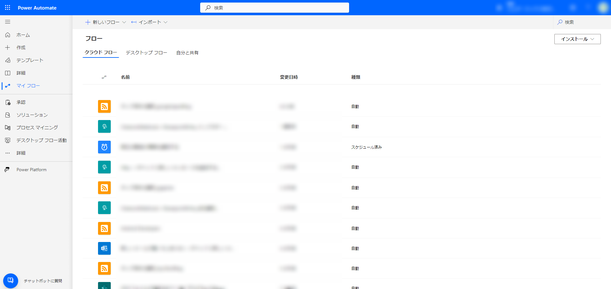
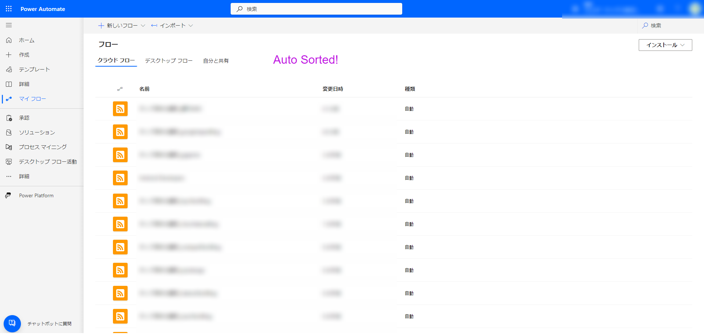

# Power Automate FlowSorter

Power Automate FlowSorterは、Power Automateのフローを種類ごとに自動で並べ替える拡張機能です。

## 機能

- Power Automateのフローを種類ごとに自動で並べ替えます。

- Before
  - 
- After
  - 

## 動作環境

- 対応ブラウザ: Google Chrome, Microsoft Edge など、Manifest V3に対応したブラウザで動作します。

## 開発者モードとしてのインストール方法

1. このリポジトリをクローンまたはZIP形式でダウンロードします。
2. ブラウザで拡張機能の管理ページを開きます（例：Google Chromeの場合、`chrome://extensions`）。
3. デベロッパーモードを有効にします。
4. 「パッケージ化されていない拡張機能を読み込む」または「Load unpacked」ボタンをクリックし、ダウンロードしたリポジトリのフォルダを選択します。
5. 拡張機能がインストールされ、有効になります。

## 使い方

1. Power Automateのウェブサイト（`https://make.powerautomate.com/environments/*`）にアクセスします。
   1. **対象ページは「マイフロー」配下の「クラウド フロー」および「自分と共有」のページです。**
2. フローが種類ごとに自動的に並べ替えられます。

## ライセンス

[LICENSE](LICENSE)

## ロゴ

[ICOOON MONOとは? | アイコン素材ダウンロードサイト「icooon-mono」 | 商用利用可能なアイコン素材が無料(フリー)ダウンロードできるサイト](https://icooon-mono.com/about-icoon-mono/)
